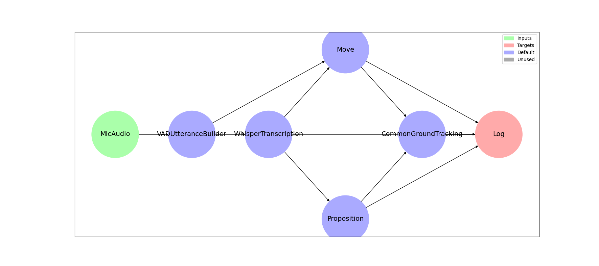

# TRACE

This repository allows for easily constructing and running complex multimodal demonstrations.

A demo is organized as a collection of "features", each of which serves a specific purpose. Examples of features are body tracking, gaze, gesture, audio transcriptions, proposition extraction, common ground tracking, logging, and more.

All features specify an output "interface", which is a class representing the data a feature will output. Features also specify zero or more input interfaces, which they require in order to calculate the output. For example, the Proposition feature has PropositionInterface as its output interface and TranscriptionInterface as its only input interface.

If a feature A needs input interface X, it can set another feature B with output interface X as a "dependency", and the output of feature B will be automatically passed into feature A. The full demo is structured as a directed graph with features as vertices and edges between a feature and all of its dependencies. This framework allows for easily creating, modifying, and running any multimodal demo which can be organized into modular features.

This repository contains a python package called "mmdemo" that provides a "Demo" class to run a demo according to its dependency graph structure. This package also contains premade features used in our common ground tracking demo and a framework to easily create new features. Another package in this repository is "mmdemo-azure-kinect", which provides features for interacting with Azure Kinect cameras and recordings (only availible on Windows). Finally, we have comprehensive tests to make sure all of the premade features and demo logic works as expected.

# Example Usage

Any number of "target" features can be given to the Demo constructor. These targets and their dependencies will be evaluated such that all dependencies of a feature are done evaluating before the feature itself evaluates. The following script will perform common ground tracking using microphone input.

```python
from mmdemo.demo import Demo
from mmdemo.features import ( CommonGroundTracking, Log,
    MicAudio, Move, Proposition, VADUtteranceBuilder, 
    WhisperTranscription )

if __name__ == "__main__":
    mic = MicAudio(device_id=6)
    utterances = VADUtteranceBuilder(mic)
    transcription = WhisperTranscription(utterances)
    props = Proposition(transcription)
    moves = Move(transcription, utterances)
    cgt = CommonGroundTracking(moves, props)

    demo = Demo(targets=[Log(transcription, props, moves, cgt, stdout=True)])
    demo.run()
```

Dependency graph visualizations can also be generated automatically by calling `demo.show_dependency_graph()`, which can be useful for making sure the demo is structured correctly. In the example above, this would create the following image.


# Setup Instructions

## Main package
Python 3.10 or higher is required if using conda because of [this unresolved issue](https://github.com/conda/conda/issues/10897). The conda environment can be created with `conda env create --file multimodalDemo.yaml`.

Install the package with `pip install -e .` from the root directory of the repo.

Download the following models from [here](https://colostate-my.sharepoint.com/:f:/g/personal/nkrishna_colostate_edu/EhYic6HBX7hFta6GjQIcb9gBxV_K0yYFhtHagiVyClr7gQ?e=W6Pm6I) and save at the given locations:

- `fasterrcnn-7-19-demo-finetuned.pth` ==> `mmdemo/features/objects/objectDetectionModels/best_model-objects.pth`
- `steroid_model/` ==> `mmdemo/features/proposition/data/prop_extraction_model/`
- `production_move_classifier.pt` ==> `mmdemo/features/move/production_move_classifier.pt`

## CUDA Installation and Pathing (For Windows)(Linux has not been tested)

WINDOWS OS: Ensure that you have CUDA Toolkit 12.4 or greater installed within Program Files for your architecture: https://developer.nvidia.com/cuda-downloads

- After installing, add the file path, `C:Program Files\NVIDIA GPU Computing Toolkit\CUDA\v12.8` to your system environment variables under `Path`. Additionally, check that the paths for `CUDA_PATH` and `CUDA_PATH_V12_6`match the newly added file path.
- If issues with CUDA arise, please check the "Solution for .dll File Errors' sub-section within the 'Common Setup Issues' section of this README file.

## Azure Kinect features (optional, only for Windows)

See [mmdemo-azure-kinect/README.md](mmdemo-azure-kinect/README.md).

## Common Setup Issues
### Solution for .dll File Errors
If you are experiencing errors related to .dll files (specially CUDA dlls i.e cublasLt64_12.dll), you can try the following steps:
1. Uninstall or Update CUDA:
    - CUDA version 12 or later is required by the demo, the latest version of CUDA can be found [here](https://developer.nvidia.com/cuda-downloads)
    - If you expect that your CUDA version should work and is up to date, begin by uninstalling CUDA from your system. Make sure to remove all associated components.
3. Reinstall/Update CUDA:
    - Install CUDA to the directory C:/Program Files/NVIDIA GPU Computing Toolkit/ (which should be the default, verify that this path exists after installing)
    - This path is recommended to avoid potential conflicts with system variables.
4. Update Environment Variables:
    - After reinstalling CUDA, restart your machine and verify that the installation path `C:/Program Files/NVIDIA GPU Computing Toolkit/` has been added to your system's environment variables (see `PATH` `CUDA_PATH` and `CUDA_PATH_V12_6`)
5. If updating/reinstalling CUDA doesn't work, try to reinstall Miniconda/Anaconda:
    - Finally, reinstall Miniconda or Anaconda. A fresh installation can resolve conflicts that might arise from previous installations, especially those that affect .dll files.


# Directory structure

- `examples` -- example demonstrations using different combinations of features. This includes our EMNLP submission demonstration in both live and prerecorded/ablation testing forms.
- `mmdemo` -- the core package in this repo which provides demo logic and premade features.
    - `features` -- a collection of premade features we have used so far.
    - `interfaces` -- interface specifications for features to use as inputs / outputs.
    - `utils` -- helper functions and classes used across multiple features
- `mmdemo-azure-kinect` -- a python wrapper library around the C++ code which interacts with Azure Kinect cameras and playback devices. This provides features which can be used alongside features in the mmdemo package.
    - `_azure_kinect-stubs` -- typing information for the wrapper library
    - `mmdemo_azure_kinect` -- the main module of the wrapper library which provides the features
    - `src` -- the C++ source code of the library
- `scripts` -- scripts for performing auxiliary tasks to the demo
    - `wtd_annotations` -- scripts for processing WTD annotation files into a format which can be used as ground truth information during ablation testing
- `tests` -- all of our tests to make sure the demo and features function correctly
    - `data` -- example data used in our tests
    - `features` -- tests for each premade feature
    - `utils` -- helper functions and classes to make writing tests easier
    - `wtd_ablation` -- tests which make sure the ground truth features work correctly

# Development

## Environment

After setting up the environment by following the instructions above, run `pre-commit install` to set up formatters to run automatically on commit. If the conda environment file changes, update the environment by running `conda env update --file multimodalDemo.yaml --prune`.

## Creating new features
Every feature must inherit from `BaseFeature[T]`, where `T` is an output interface which inherits from `BaseInterface`. The required methods are documented in [mmdemo/base_feature.py](mmdemo/base_feature.py). For example, if we wanted to create a feature which takes a color image as input and outputs a predicted depth image, we would do something along the lines of the following:
```python
@final
class DepthPredictor(BaseFeature[DepthImageInterface]):
    def __init__(self, color: BaseFeature[ColorImageInterface]):
        super().__init__(color)

    def initialize(self):
        # Initialize model
        pass

    def get_output(self, color: ColorImageInterface) -> DepthImageInterface | None:
        if not color.is_new():
            return None
        # evaluate model on color.frame
        pred = ...
        return DepthImageInterface(frame=pred, frame_count=color.frame_count)
```
This feature could now seamlessly be used as a dependency to any feature that requires a depth image as input. See `mmdemo/features/` for examples of how existing features are implemented. Also note that a feature should never directly modify any of its input interfaces or dependent features. This breaks the modularity of the program and could cause other features to break in unexpected ways.

## Testing

Pytest is used for all of the tests in this project. Tests which require our own machine learning models are marked as "model_dependent" and can be executed with `pytest -m "model_dependent"`. These will likely not all pass. Other tests can be executed with `pytest -m "not model_dependent"`, and these should all pass if there are no bugs. To execute all tests at once, just run `pytest`.

## Contributing

See [CONTRIBUTING.md](CONTRIBUTING.md) for contribution guidelines.

Feel free to reach out to Hannah VanderHoeven (Hannah.VanderHoeven@colostate.edu) with any questions.
